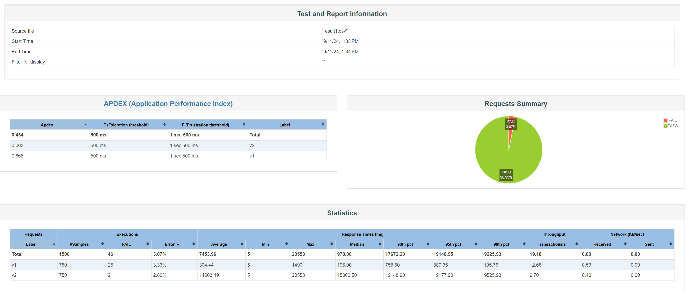
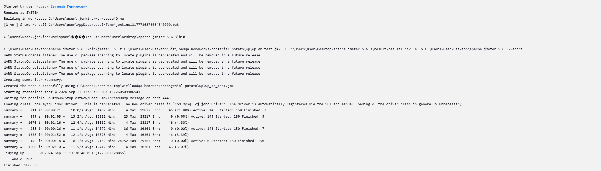
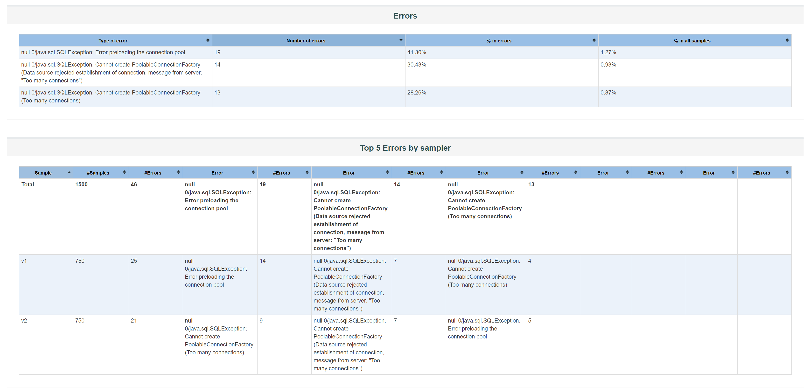

Отчет о проведении нагрузочного тестирования WordPress

ФИО: Корзун Евгений Гераманович
Дата: 11 сентября 2024
ID заявки на тестирование: 1

Цель тестирования заключается в подтверждении заявленной
производительности сайта а также в
определении его производительности под нагрузкой одновременной работы с 1000 пользователями. Время отклика страницы не более 1 секунды.
Конфигурация стенда
Серверы: 1 сервер
Ядра процессора: 6 ядер на сервер
Память: 32 GB RAM на сервер
Операционная система: Windows 10 Pro 22H2 сборка ОС 19045.3803
Вспомогательное ПО: Jenkins, MariaSQL, Jmeter, Docker, VScode 
Сценарий тестирования
Тестирование было выполнено с использованием JMeter для симуляции
нагрузки. В сценарии тестирования предусматривалось создание одновременно на сайте 1500 комментариев от 1000 пользователей.
 
Во время тестирования особое внимание уделялось внимание стабильности системы при высокой нагрузке, и корректности отображения и записи в базу данных результтов проведенной нагрузки и отображение их в пользовательском интересфейсе сайта.

Графики
Метрики хоста:

Результаты нагрузки 
96,93% отправленных запросов были корректно обработаны.
3,07% запросов завершились неудачно.

Найденные в процессе дефекты

1. Наиболее частая ошибка предварительной зарузки пула сообщений и составляет 41,3% от общего числа ошибок.
2. Отмечается перегрузка сервера при большом количестве запросов в 30,43% от общего числа ошибок.
3. В 28,26% ошибок не удалось создать подключение к серверу базы данных.
   
   Стоит отметить что общее число ошибок от запросов составляет чуть более 3% что может считаться удовлетворительным результатом с четом того что среднее время ответа от сервера составляет менее 1 секунды.

Трудоемкость
Фамилия, Кол-во дней:
Корзун, 3
Календарная длительность
Заявка выполнена за 3 календарных дней.
Выводы
1. Существующие проблемы: Наблюдается деградация
производительности при нагрузке выше 1000 пользователей.
1. Опасения: При дальнейшем увеличении количества пользователей
возможно ухудшение устойчивости системы вплоть до полного отказа работоспособности.
1. Предложения: Рекомендуется провести оптимизацию запросов к базе
данных, рассмотреть возможность увеличения мощнотей серверов для увлечения возможных пулов запросов. Также, возможно, следует рассмотреть возможность добавления защиты от Ddos атак.
✅ Заявленная производительность подтверждена